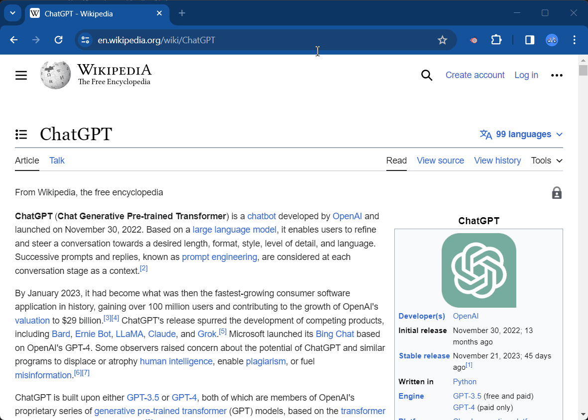
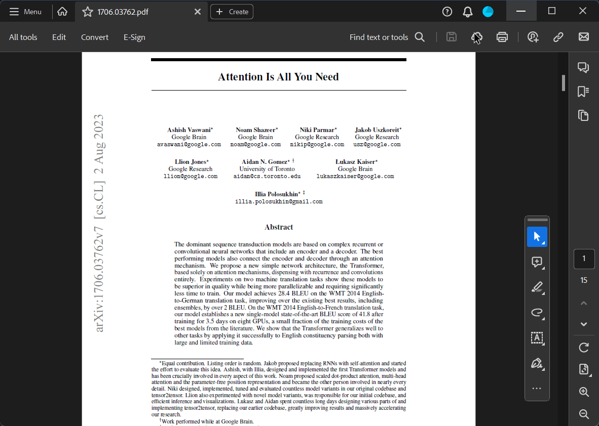

# ChatFlow: ChatGPT Prompt Populator Browser Extension

This is a **free** and **open-source** browser extension that helps populate prompts in a new ChatGPT chat.

<h2 align="center" width="100%">⚡ Use ChatGPT Faster</h2>

Figure 1: A quick demonstration of using ChatGPT for efficient communication.

<h2 align="center" width="100%">🌊 Ask from anywhere, any file (using FlowLauncher)</h2>

Figure 2: Demonstrating the use of FlowLauncher with ChatGPT.

<h2 align="center" width="100%">⚙️ Customize With Your Prompts</h2>

Figure 3: Customizing ChatGPT with user-defined prompts.

## Features

- Automatically opens the model selection menu and selects a specified model
- Populates the prompt textarea with a specified prompt
- Listens for messages from the background script to process models and prompts
- Supports FlowLauncher to pass a prompt quickly

## Installation

1. Clone this repository
2. Open Chrome and navigate to `chrome://extensions`
3. Enable Developer mode by ticking the checkbox in the upper-right corner
4. Click on the "Load unpacked" button
5. Select the `chatflow-chrome` directory from the cloned repository

Note: You need to install the FlowLauncher to ask ChatGPT from any file in your computer

## Usage

1. Navigate to `chrome://extensions` and find the "OpenAI Chat Prompt Populator" extension
2. Click on the "Options" link to open the settings page
3. Select your default model from the dropdown menu and click "Save"
4. Use the plugin either through the right-click context menu or via Flow Launcher. 

## Files

- `background.js`: Contains the background script for the extension
- `content.js`: Contains the content script for the extension, which interacts with the web page
- `manifest.json`: Contains metadata about the extension
- `settings.html`: Contains the settings page for the extension
- `settings.js`: Contains the script for the settings page

## Contributing

Fork and add your features easily. This is a simple beginner-friendly Chrome plugin. Pull requests are welcome. For major changes, please open an issue first to discuss what you would like to change.

## License

[MIT](https://choosealicense.com/licenses/mit/)
